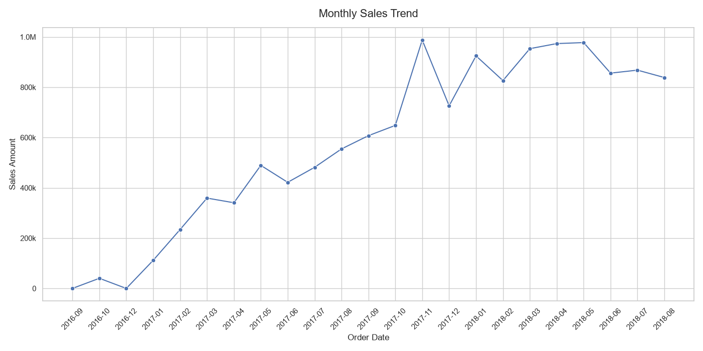
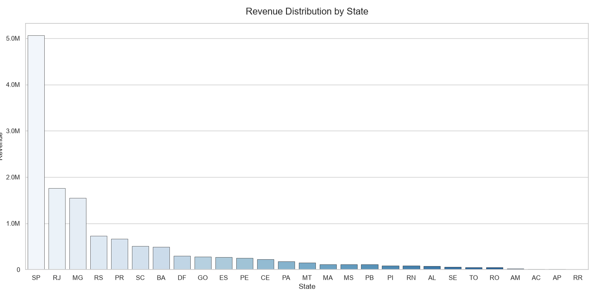
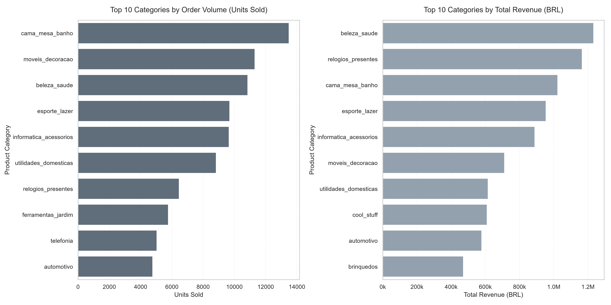
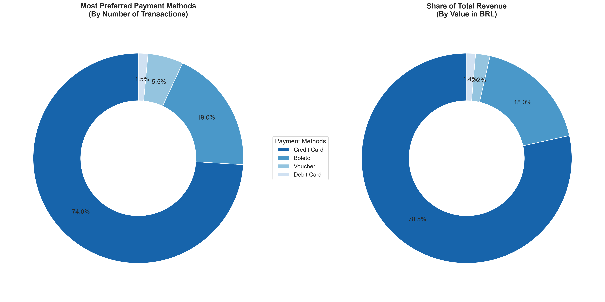
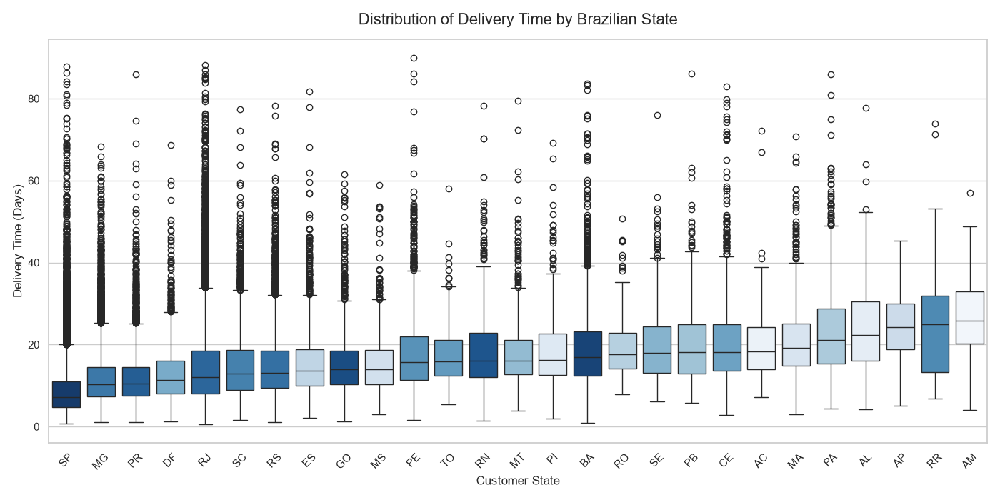
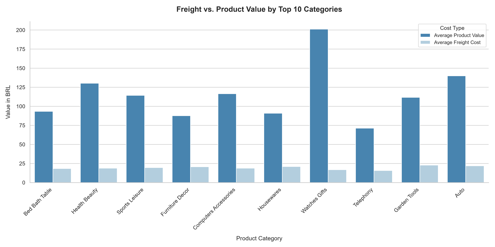
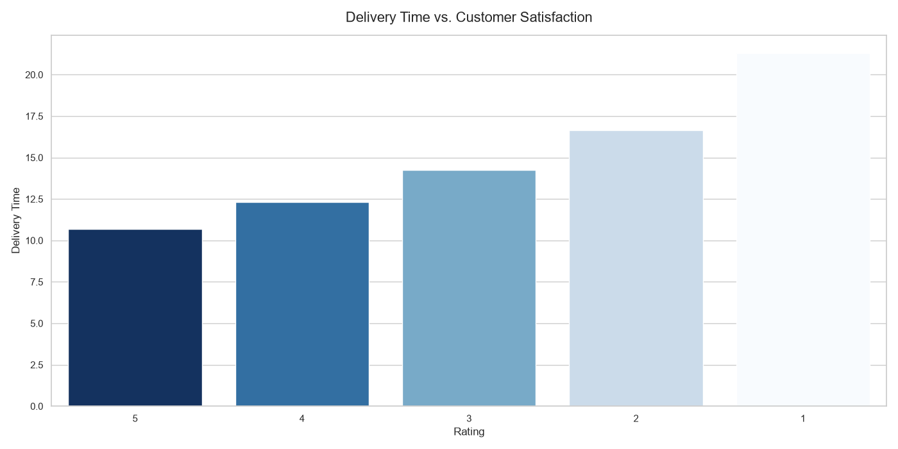

# Olist E-commerce Data Analysis Project

## Overview
This project provides an Exploratory Data Analysis (EDA) of the [Brazilian E-Commerce Public Dataset by Olist](https://www.kaggle.com/datasets/olistbr/brazilian-ecommerce). The goal was to transform raw relational data into actionable business insights regarding logistics efficiency, sales trends, and customer behavior.

## Tech Stack
* **Languages:** Python
* **Data Manipulation:** Pandas
* **Database & SQL:** SQLAlchemy, SQLite3
* **Visualization:** Seaborn, Matplotlib
* **Environment:** PyCharm (for scripts), Jupyter Notebooks (for EDA)
* **Version Control:** Git & GitHub


## About the Dataset
* **Source:** [Kaggle - Olist Dataset](https://www.kaggle.com/datasets/olistbr/brazilian-ecommerce)
* **License:** [CC BY-NC-SA 4.0](https://creativecommons.org/licenses/by-nc-sa/4.0/)
* **Description:** A dataset containing information on 100k orders from 2016 to 2018 made at multiple marketplaces in Brazil.

## Methodology
The project follows a standard data science workflow:
1. **Data Preparation:** Loading data, cleaning types, and handling missing values.
2. **SQL Integration:** Using SQLite and `pandas` to query the relational structure of the database.
3. **Visualization:** Applying `seaborn` and `matplotlib` to identify trends, distributions, and outliers.

<table>
  <thead>
    <tr>
      <th style="text-align: left;">Section</th>
      <th style="text-align: left;">Analysis Question</th>
      <th style="text-align: left;">Visualization Type</th>
    </tr>
  </thead>
  <tbody>
    <tr>
      <td rowspan="4"><b>Part 1: Sales Performance & Commercial Structure</b></td>
      <td>1.1 Monthly Sales Trend</td>
      <td>Line Chart</td>
    </tr>
    <tr>
      <td>1.2 Revenue Distribution by State</td>
      <td>Bar Chart</td>
    </tr>
    <tr>
      <td>1.3 Top Product Categories</td>
      <td>Dual-Panel Horizontal Bar Chart</td>
    </tr>
    <tr>
      <td>1.4 Payment Method Analysis</td>
      <td>Donut Chart</td>
    </tr>
    <tr>
      <td rowspan="3"><b>Part 2: Logistics & Operational Efficiency</b></td>
      <td>2.1 Delivery Time by State</td>
      <td>Box Plot</td>
    </tr>
    <tr>
      <td>2.2 Freight vs. Product Value</td>
      <td>Grouped Bar Chart</td>
    </tr>
    <tr>
      <td>2.3 Delivery Time vs. Customer Satisfaction</td>
      <td>Bar Chart</td>
    </tr>
  </tbody>
</table>

##  Key Findings
*The following insights were derived from the analysis of the Olist e-commerce dataset:*

###  Part 1: Sales Performance & Commercial Structure

### 1.1 Monthly Sales Trend:
* **Aggressive Expansion:** Throughout 2017, the platform demonstrated rapid market penetration, scaling monthly revenue predictably from 100k BRL to over 600k BRL.
* **Seasonal Dependency:** November 2017 marks an absolute historical peak (nearly 1M BRL), proving that Black Friday promotions are a massive, singular driver for Olist's yearly revenue model.
* **Market Maturity:** In 2018, the initial explosive growth transitioned into a stable, high-volume plateau, consistently generating between 850k and 1M BRL in monthly revenue.
* **Data Boundary Optimization:** Trailing data from September and October 2018 was deliberately excluded from the analysis. These months contain incomplete tracking periods in the raw dataset, which would artificially distort the trend line downward. Cutting the timeline at August 2018 ensures data integrity.

  

### 1.2 Revenue Distribution by State:
* **Market Concentration:** The financial data confirms that São Paulo (SP) is the undisputed powerhouse of the marketplace, single-handedly generating the lion's share of Olist's entire revenue stream.
* **Single Point of Failure (Financial Risk):** This extreme concentration of revenue exposes Olist to severe vulnerability. Since the vast majority of sales are generated exclusively within the São Paulo (SP) region, any localized disruption—such as logistical strikes, extreme weather, or regional infrastructure failures—would not just delay packages, but instantly paralyze the marketplace's primary financial engine.

  

### 1.3 Top Product Categories:
* **Volume vs. Value Kings:** While `Bed Bath Table` leads the platform in total units sold, `Health Beauty` takes the #1 spot in total revenue, capturing the highest financial share of the marketplace.
* **High-AOV Premium Shift:** `Watches Gifts` demonstrates a massive high-ticket multiplier; despite sitting lower at #7 in transaction volume, it represents the #2 largest revenue stream for Olist.
* **Hidden Gems Discovered:** Separating the metrics revealed categories like `Cool Stuff` and `Toys` within the top financial earners. These high-margin/high-price categories scale the business without requiring unsustainable transactional volume.
* **Operational Strategy:** High-volume categories maintain customer acquisition loops and shipping ecosystem activity, while high-value electronics, gifts, and health products scale total marketplace GMV.
  


### 1.4 Payment Method Analysis:
* **Credit Card Supremacy:** Credit cards are the primary financial driver for Olist, responsible for 74.0% of transaction volume and 78.5% of total GMV, proving that instant credit availability scales order values.
* **The Core Alternative (Boleto):** The cash-based `Boleto` remains vital for market accessibility, holding a solid second place with 19.0% of volume and 18.0% of revenue.
* **Perfect Metric Alignment:** The ranking of payment methods is nearly identical across both volume and revenue. This proves that no single payment method artificially inflates transaction counts with micro-transactions, nor handles massive corporate orders exclusively.
* **Niche Alternatives:** Vouchers (5.5% vol / 2.2% rev) and debit cards (1.5% vol / 1.4% rev) remain low-impact channels, together representing less than 4% of total revenue, highlighting that credit options fuel the marketplace cash flow.
  


### Part 2: Operational Efficiency & Logistics

### 2.1 Logistics Performance: 
* **Regional Disparities:** The economic core (SP, MG, PR) enjoys highly efficient logistics with median delivery times under 10–12 days. In contrast, northern and remote states (AP, RR, AM) face severe bottlenecks, with medians spiking to 20–30 days.
* **High Volatility:** Remote regions suffer from extreme unpredictability (wider interquartile ranges), making delivery promises highly unreliable for customers in those areas.
* **Volume-Driven Failures:** While major hubs like SP and RJ are fast on average, they experience a high absolute volume of severe outliers (orders stretching to 80+ days), highlighting a critical edge-case failure mode in high-density areas.
* **The Challenge:** The dataset reveals that São Paulo (SP) dominates the marketplace, driving 60-70% of all transactions. This extreme concentration creates a single point of failure (SPOF). Any regional disruption—such as freight strikes, severe weather, or infrastructure failures in SP—could immediately paralyze Olist's core operations and revenue streams.
* **Analytical Limitation:** Delivery times were measured end-to-end (purchase to delivery). A critical next step for the business would be to isolate courier transit time from internal merchant fulfillment speed to precisely target the root cause of these delays.
 


### 2.2 Freight vs. Product Value:
* **Inelastic Freight Rates:** The analysis reveals that shipping fees are rigid, staying locked around 15-22 BRL regardless of item cost. This suggests weight, volume, or baseline postal contracts dictate logistics pricing rather than product category retail value.
* **The Premium Margin Leader:** `Watches Gifts` showcases peak operational efficiency, hitting a maximum average product value of 200 BRL while maintaining an incredibly low shipping cost. It stands out as Olist's most profitable category relative to weight/size constraints.
* **Logistics Friction in Low-Cost Sectors:** In categories like `Telephony`, fixed freight rates constitute over 21% of the total customer expense. This high logistics-to-value ratio represents a prime drop-off risk at the checkout phase.
  


### 2.3 Delivery Time vs. Customer Satisfaction: 
* **Logistics Dictates Retention:** The analysis reveals a brutal truth: shipping duration completely drives customer ratings. Satisfaction remains high only when fulfillment operates within tight operational windows.
* **The 14-Day Psychological Boundary:** Customer sentiment remains relatively positive up to the 14-day mark (~10.6 days for 5-stars, ~14.2 days for 3-stars). This 2-week period represents the maximum tolerance threshold for the average user.
* **The Three-Week Collapse:** When delivery times breach the threshold and shoot up to 21.2 days, customer satisfaction plummets to a 1-star rating. Delays of this magnitude represent Olist's primary risk factor for negative reviews.
* **Operational Strategy:** To protect platform growth, Olist should implement automated alerts for shipments crossing the 14-day threshold in transit. Optimizing fulfillment for these delayed lanes is the fastest way to improve overall marketplace loyalty.
  


## How to Run
1. **Clone the repository:**
   ```bash
   git clone https://github.com/Chrzanisko/data-driven-ecommerce.git
   cd data-driven-ecommerce
2. **Install dependecies:**
   ```bash
   pip install -r requirements.txt
3. **Data Setup:  <br>**
   Download the Olist dataset from Kaggle. Extract all .csv files and place them into the data/ directory.
   <br> <br>
4. **Initialize Database:**
   ```bash
   python src/clear_and_load_data.py
5. **Analyze: <br>**
   Open notebooks/eda.ipynb in your IDE and run the cells sequentially to perform the analysis.
